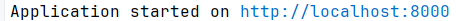

> _Fork_ deze leertaak en ga aan de slag. Onderstaande outline ga je gedurende deze taak in jouw eigen GitHub omgeving uitwerken. De instructie vind je in: [docs/INSTRUCTIONS.md](docs/INSTRUCTIONS.md)

# Titel
<!-- Geef je project een titel en schrijf in één zin wat het is -->
Favorieten huizenlijst als gebruiker wil ik huizen kunnen
opslaan in een favorieten huizenlijst en een beoordeling kunnen geven aan het huis 
## Inhoudsopgave

  * [Beschrijving](#beschrijving)
  * [Gebruik](#gebruik)
  * [Kenmerken](#kenmerken)
  * [Installatie](#installatie)
  * [Bronnen](#bronnen)
  * [Licentie](#licentie)

## Beschrijving
<!-- In de Beschrijving staat kort beschreven wat voor project het is en wat je hebt gemaakt -->
<!-- Voeg een mooie poster visual toe 📸 -->
<!-- Voeg een link toe naar Github Pages 🌐-->
Je bent in je eentje of samen op zoek naar een huis en wil deze opslaan dit kan in een favorieten huizenlijst en daar 
staan dan je huizen ook kan je een beoordeling geven aan het huis

deze foto is de koop heel nederland pagina en als je op het hartje drukt voeg je het huis toe aan de favorieten huizenlijst

Dit is de favorietenhuizenlijst en hier kan je al je huizen zien die je hebt opgeslagen

## Gebruik
<!--Bij Gebruik staat hoe je project er uit ziet, hoe het werkt en wat je er mee kan. -->

Je drukt op de groene knop code en dan kan je de code downloaden als je 
in de terminal npm start doet dan moet je dit kunnen zien

druk je op de link dan opent die de pagina
## Kenmerken
<!-- Bij Kenmerken staat welke technieken zijn gebruikt en hoe. Wat is de HTML structuur? Wat zijn de belangrijkste dingen in CSS? Wat is er met Javascript gedaan en hoe? Misschien heb je een framwork of library gebruikt? -->
<ul>
<li>EJS als view engine</li>
<li>Express als framework</li>
<li>node js om het server deel op te starten</li>
</ul>

## Installatie
<!-- Bij Instalatie staat hoe een andere developer aan jouw repo kan werken -->
je moet node js hebben geinstaleerd wil je hiermee werken

<a href="https://nodejs.org/docs/latest/api/">documentatie over node js</a>
Je drukt op de groene knop code en dan kan je de code downloaden als je
in de terminal npm start doet dan moet je dit kunnen zien

druk je op de link dan opent die de pagina

ook kan je deze repository forken en dan kan je in je eigen repository verder werken 

## Bronnen

deze bronnen heb ik gebruikt om deze pagina te realiseren

<ul>
<li><a href="https://ejs.co/">ejs documentatie</a></li>
<li><a href="https://expressjs.com/">express documentatie</a></li>
<li><a href="https://nodejs.org/docs/latest/api/">node js documentatie</a></li>
</ul>

## Licentie

This project is licensed under the terms of the [MIT license](./LICENSE).
